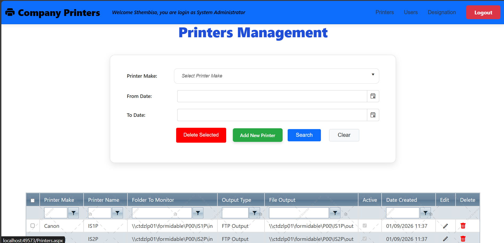
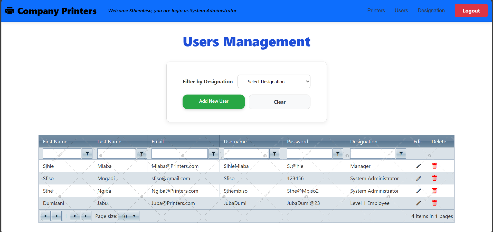
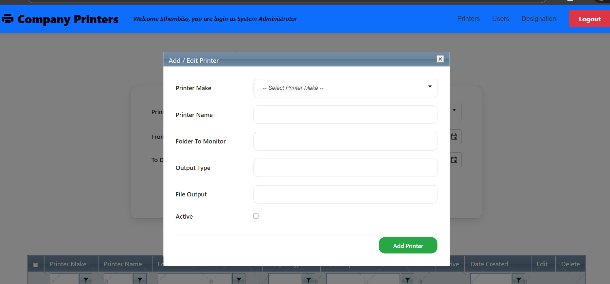
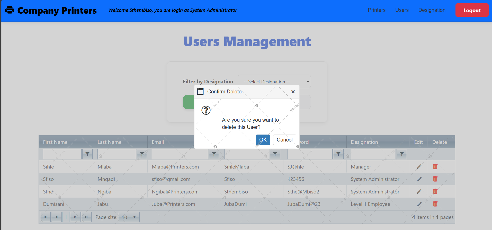
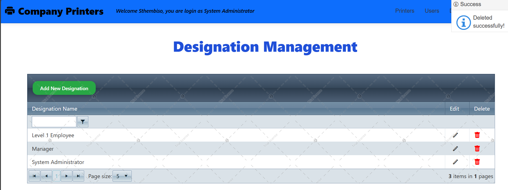

# Company Printers Management System

## 📌 Overview
Company Printers is an ASP.NET WebForms application designed to manage printers, users, and designations within an organization.

## 🚀 Technologies Used
- ASP.NET WebForms
- C#
- Telerik UI for ASP.NET AJAX
- SQL Server
- ADO.NET
- Git & GitHub

## ✨ Features
- Add / Edit / Delete Printers
- User Management
- Designation Management
- Search and Filtering
- Telerik RadGrid integration
- Notifications using RadNotification
- Ajax Panels for smooth UI experience

## 🛠 Database
The system uses SQL Server for data storage.
Database scripts can be found in the /Database folder.

## 📷 Application Screenshots

### Printers Dashboard

### Users Dashboard

### Add Printer Modal

### Confirm Delete Message

### Notification Message

## 👨‍💻 Author
Mzwandile Byron Mngadi
Advanced Diploma in ICT
